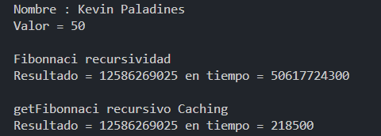
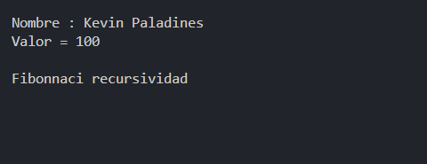
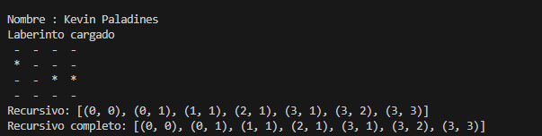

# PROGRAMACION DINAMICA

## 📌 Información General

- **Título:** Programacion Dinamica
- **Asignatura:** Estructura de Datos
- **Carrera:** Computación
- **Estudiante:** Kevin Paladines
- **Fecha:** 16/07/2025
- **Profesor:** Ing. Pablo Torres

---

## 📌 Capturas Ejercicios

- **Ejercicio 1**

    **Con 50**

- **Ejercicio 1**

    **Con 100**

el de 100 no cargo :(

- **Ejercicio 2**

    **Laberintos**

